# Football Match Outcome Prediction
The Football Match Outcome Prediction project: the user processes a large number of files that contain information about football matches that have taken place since 1990. The data has to be cleaned so it can be fed to the model. Then, different models are trained with the dataset, and the best performing model is selected. The hyperparameters of this model are tuned, so its performance is improved.

Trained Models:
- Logistic Regression
- Random Forest
- Decision Tree
- SVM
- AdaBoost on Decision Tree
- AdaBoost on Logistic Regression
- Gradient Boost
- MLP

CONCLUSION:
The best prediction accuracy results has been obtained through ADABOOST build on Decision Tree model, closely followed by SVM classifier. With scaled data: the stadium capacity features had been scaled to match other features.
The test accuracy score is the same for all sets: 
- AdaBoost on DTree: 49.53%
- SVM : 49.32%

The Random Forest model shows the most overfitting:
- 99% on train vs. 47.55% on test data

The least successful were the models that were fit without scaling. 

After that the resultant DataSet is as follows:
<br>
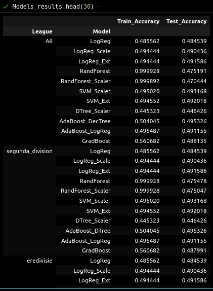
<br>
The best accuracy scores are shown below:
<br>
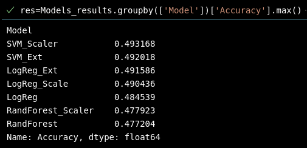


## Table of Contents
* [General Info](#general-information)
* [Technologies Used](#technologies-used)
* [Features](#features)
* [Screenshots](#screenshots)
* [Setup](#setup)
* [Usage](#usage)
* [Project Status](#project-status)
* [Room for Improvement](#room-for-improvement)
* [Acknowledgements](#acknowledgements)
* [Contact](#contact)
<!-- * [License](#license) -->


## General Information
- Processed and cleaned a dataset with more than 100K samples using pandas.

- Groupby and Cummulative scores with pivot tables approach is used to create new features.

- Carried out Exploratory Data Analysis to form hypotheses on the dataset.

- Trained various models to obtain optimal result.


## Technologies Used
- Python
- Pandas
- Seaborn
- Selenium
- Webdriver / Chrome
- SciKit Learn 


## Features
- Data obtained from the following links:
https://aicore-files.s3.amazonaws.com/Data-Science/Football.zip - Score Data
https://aicore-files.s3.amazonaws.com/Data-Science/Match_Info.csv - Match Data
https://aicore-files.s3.amazonaws.com/Data-Science/Team_Info.csv - Stadium Data 

- Scraper is used to scrape ELO scores for each team for Model training purposes from the provided links. The used website: www.besoccer.com . Key features: accept cookies and cancel subscription prior to scraping

- Model Training results show Accuracy scores per league as well as for the whole set

- Models used: Logistic Regression, Random Forest, Support Vector Machine (SVM), Decision Tree, Gradient Boost and AdaBoost on Decision Tree and Logistic Regression. Features value set is used unmodified for Logistic Regression model training, however for the rest of the model it is scaled and/or piplined through standartisation and normalisation. If the features data set is unscaled, it is failed to converge.


## Screenshots
Score Table after the download and data cleanup/processing.
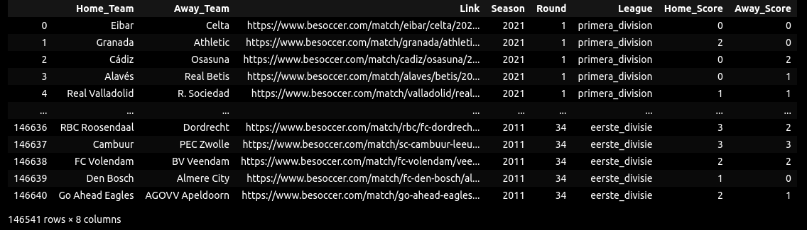

List of all columns/data in the downloaded scv file
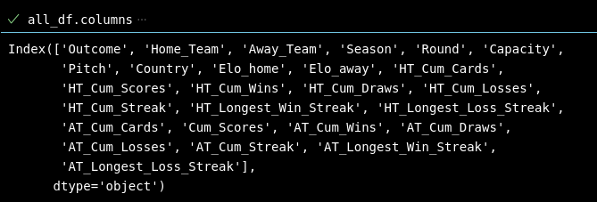

Heatmap shows no NA values in the data set with all features.
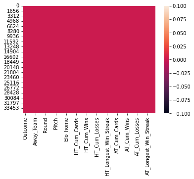

Frequency all outcomes for the Home_Team: -1 for Loss, 0 for Draw, 1 for Win.
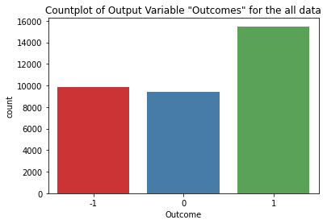

Overview of the distribution of all features. The plot is used to evaluate gaussian and non-gaussian distribution of data
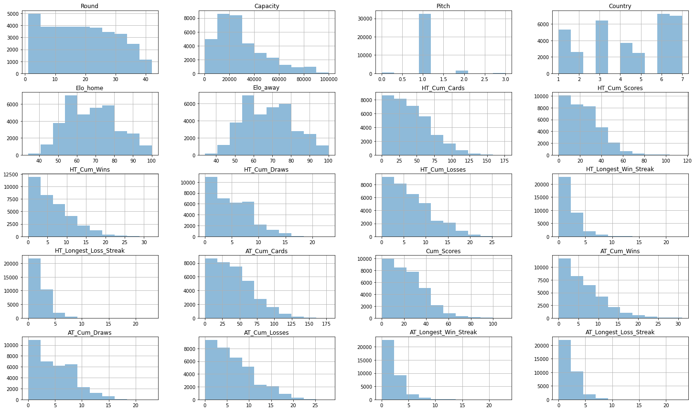

Correlation matrix between features. The plot shows the most correlation are among hometeam and awayteam data, which is expected as the data repeats at times. 
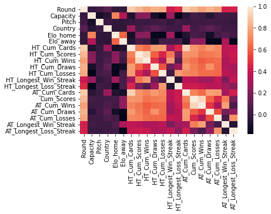

En example of the cleaned and processed data used for the model training for one of the league, 2_liga.
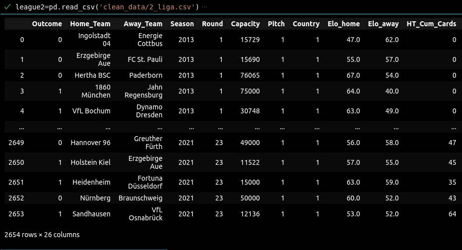

Sample of the accuracy scores obtined for 2_liga league after the model training.
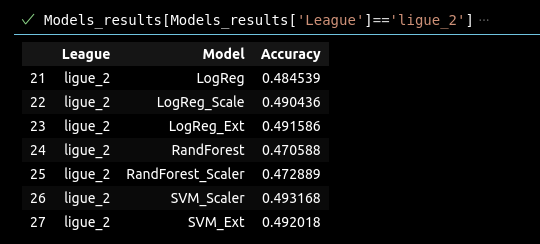

The sanpshot of the overall accuracy scores for train and test data sets, per each league.
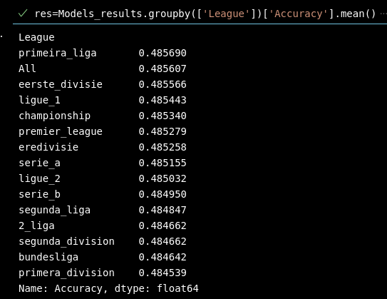


## Setup
Required Libraries:
    pandas
    numpy
    seaborn
    matplotlib
    sklearn
    glob
    os
    sys
    time
    selenium
    webdriver_manager.chrome
    decimal
    itertools
    operator
    requests
    zipfile
    io
    pickle
    urllib.request
    shutil


## Usage
Sample of code/data-processing

Upload multiple csv files into one dataframe:
```
#Read all csv files into one pandas df
path = "./Results"
csv_files = glob.glob(path + "/**/*.csv", recursive = True)
results_df = [pd.read_csv(f) for f in csv_files]
pd.set_option('display.max_columns', None)
final_df   = pd.concat(results_df, ignore_index=True)
final_dfs
```

Cleaning Match data
```
cols=['Home_Yellow', 'Away_Yellow', 'Home_Red', 'Away_Red']
match_df[cols] = match_df[cols].astype('Int64')
match_df['Season'] = match_df['Link'].map(lambda x: x.split("/")[-1])
match_df['HT_Link'] = match_df['Link'].map(lambda x: x.split("/")[-3])
match_df['AT_Link'] = match_df['Link'].map(lambda x: x.split("/")[-2])
match_df['HT_Game_Penalty_Cards']=match_df['Home_Yellow']+match_df['Home_Red']
match_df['AT_Game_Penalty_Cards']=match_df['Away_Yellow']+match_df['Away_Red']
cols=['Date_New','Link','Referee','Home_Yellow', 'Away_Yellow', 'Home_Red', 'Away_Red']
match_df.drop(cols,inplace=True, axis=1)
match_df['Season']=match_df['Season'].astype('int')
match_df = match_df[match_df['Season']>2012]
```

ELO score Scraper Code sample
```    
def scraping(self):
for i in range(3): #(len(self.match_link.index)):
    link=str(self.match_link.loc[i, 'Link'])
    print(link)
    self.driver.get(link)
    time.sleep(5)
    self.driver.find_element(By.XPATH, config.ANALYSIS_XPATH).click()
    time.sleep(2)
    home_elo=self.driver.find_element(By.XPATH, config.HOME_ELO_XPATH).text
    away_elo=self.driver.find_element(By.XPATH, config.AWAY_ELO_XPATH).text
    self.match_link.loc[i, ['Home_ELO']]=home_elo
    self.match_link.loc[i, ['Away_ELO']]=away_elo
    time.sleep(2)
self.match_link.to_csv('match_ELO.csv')
```

Model Training Function and application
```
def train_model (X,Y,model):
    """This function applies pre-defined model to the given set of features and outcomes.
    The train/test split is set at 80/20.
    Return accuracy score

    Args:
        X (dataframe): dataset with features (can be scaled, normalised, standardised)
        Y (array or dataframe): outcomes (set of the results)
        model (assigned model from SkLearn): model is assigned prior to application 
    """
    X_train, X_test, y_train, y_test = train_test_split(X, Y, test_size=0.2, random_state=0)
    model.fit(X_train, y_train)
    return(model.score(X_test, y_test))
#LOGISTIC REGRESSION
LR_model=LogisticRegression()
mscore=train_model(X, Y, LR_model)
temp_df=update_dict('All', 'LogReg', mscore)
Models_results = pd.concat([Models_results, temp_df], ignore_index=True)
```

## Project Status
Project is: _in progress_ 


## Room for Improvement

To do:
- Train the following models:K -Nearest Neighbour, Naive Bayes
- Break data set into various subsets: seasons, city, etc.


## Acknowledgements
- This project was inspired by AiCore training program


## Contact
Created by [@irinawhite](irina.k.white@gmail.com) - feel free to contact me!

