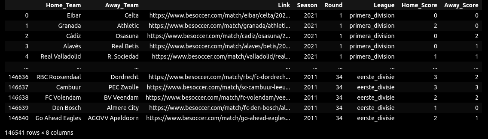

# Football Match Outcome Prediction
The Football Match Outcome Prediction project: the user processes a large number of files that contain information about football matches that have taken place since 1990. The data has to be cleaned so it can be fed to the model. Then, different models are trained with the dataset, and the best performing model is selected. The hyperparameters of this model are tuned, so its performance is improved.

## Table of Contents
* [General Info](#general-information)
* [Technologies Used](#technologies-used)
* [Features](#features)
* [Screenshots](#screenshots)
* [Setup](#setup)
* [Usage](#usage)
* [Project Status](#project-status)
* [Room for Improvement](#room-for-improvement)
* [Acknowledgements](#acknowledgements)
* [Contact](#contact)
<!-- * [License](#license) -->


## General Information
- Processed and cleaned a dataset with more than 100K samples using pandas

- Carried out Exploratory Data Analysis to form hypotheses on the dataset


## Technologies Used
- Python/ Pandas


## Features
- Data obtained from the following links:
* https://aicore-files.s3.amazonaws.com/Data-Science/Football.zip - Score Data
* https://aicore-files.s3.amazonaws.com/Data-Science/Match_Info.csv - Match Data
* https://aicore-files.s3.amazonaws.com/Data-Science/Team_Info.csv - Stadium Data 


## Screenshots



## Setup
pandas library


## Usage
Upload multiple csv files into one dataframe:
```
#Read all csv files into one pandas df
path = "./Results"
csv_files = glob.glob(path + "/**/*.csv", recursive = True)
results_df = [pd.read_csv(f) for f in csv_files]
pd.set_option('display.max_columns', None)
final_df   = pd.concat(results_df, ignore_index=True)
final_dfs
```

Cleaning Match data
```
match_df['Referee'] = match_df['Referee'].str.strip('\r\nReferee:')
match_df['Date_New'] = match_df['Date_New'].astype('string')
match_df['Referee'] = match_df['Referee'].astype('category')
match_df['Season1']=match_df['Date_New'].str.split(',', expand=True)[1]
match_df['Season']=match_df['Season1'].str.split(' ', expand=True)[3]
cols=['Link', 'Season1', 'Date_New']
match_df.drop(cols,inplace=True, axis=1)
cols=['Home_Yellow', 'Away_Yellow', 'Home_Red', 'Away_Red', 'Season']
match_df[cols] = match_df[cols].astype('Int64')
match_df
```


## Project Status
Project is: _in progress_ 


## Room for Improvement

To do:
- Currently working on using selenium/drive to upload ELO scores from the provided links


## Acknowledgements
Give credit here.
- This project was inspired by AiCore intensive training program


## Contact
Created by [@irinawhite](irina.k.white@gmail.com) - feel free to contact me!

